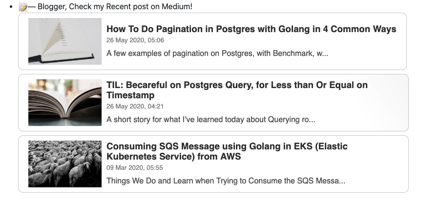

# github-readme-rss

**Howdy there!!!**

Show your recent published article from Medium on your Readme.



## Index

* [Support](#support)
* [Getting Started](#getting-started)
* [Contribution](#contribution)


## Support

You can file an [Issue](https://github.com/bxcodec/github-readme-medium-recent-article/issues/new).
See documentation in [Godoc](https://godoc.org/github.com/bxcodec/github-readme-medium-recent-article) or in [go.dev](https://pkg.go.dev/github.com/bxcodec/github-readme-medium-recent-article?tab=doc)


## Getting Started
#### Usage

Put this on your Readme. Change the @imantumorang with your medium username.

**Format:**
```bash
  https://github-readme-medium-recent-article.vercel.app/medium/<medium-username>/<article-index>
```
- `medium-usernmae`: your medium username/profile
- `article-index` : your recent article index. e.g: `0` means your latest articles.

#### Example
```html
 <a target="_blank" href="https://github-readme-medium-recent-article.vercel.app/medium/@imantumorang/0">
```


## Inspirations and Thanks

- [Alif Readme Profile](https://github.com/alfari16/alfari16) for the initial idea


## Contribution
---

To contrib to this project, you can open a PR or an issue.
